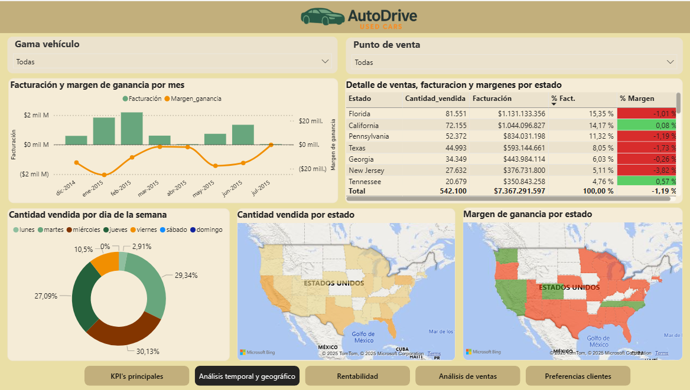
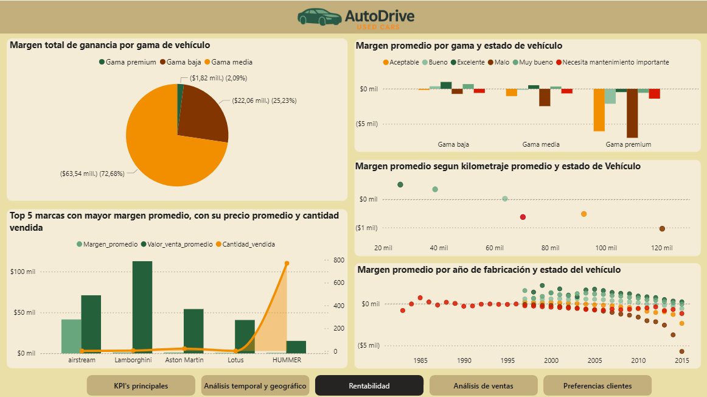
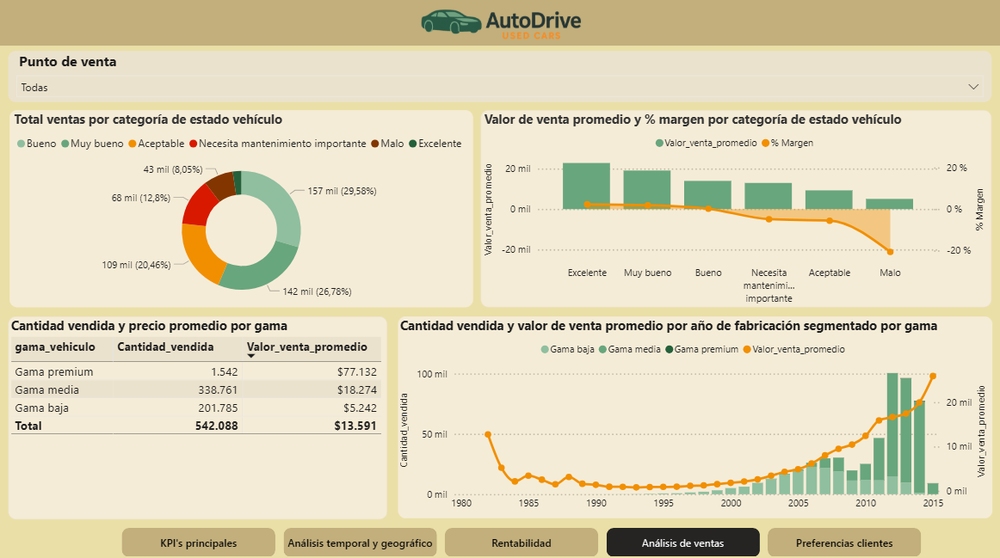
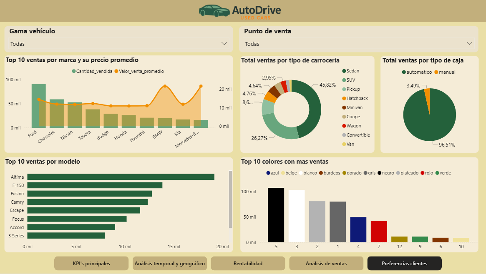

# 🚗 Data-Driven Insights para la Optimización de Ventas de Vehículos Usados en EE.UU.

**Autora:** Ghiselle Butron  
**Bootcamp Data Analytics – Unicorn Academy**
**08/2025**

---

## 📌 Resumen

Este proyecto analiza más de **550.000 registros** de ventas de vehículos usados con el objetivo de mejorar los **márgenes de ganancia**, entender el **comportamiento del cliente** y **optimizar la estrategia comercial** de AutoDrive, una empresa automotriz con operaciones en EE.UU., Canadá y Puerto Rico. El trabajo combina limpieza y modelado de datos en MySQL con la construcción de un dashboard interactivo en Power BI para que los equipos comerciales y de operaciones identifiquen oportunidades de crecimiento de manera ágil.

---

## 🎯 Objetivos del proyecto

- Analizar el desempeño de ventas por región, fecha y segmento del vehículo.
- Identificar factores que afectan la rentabilidad: estado del vehículo, antigüedad, kilometraje, tipo de transmisión y color.
- Detectar preferencias de los clientes y su impacto sobre el margen.
- Generar recomendaciones accionables basadas en datos para maximizar la rentabilidad

---

## 🗃️ Dataset

- **Fuente:** Datos internos simulados de AutoDrive (adaptados de un dataset público de Kaggle en [Kaggle - Used Cars Dataset]((https://www.kaggle.com/datasets/austinreese/craigslist-carstrucks-data))).
- **Volumen:** 558.837 registros de ventas individuales.
- **Periodo de análisis:** diciembre 2014 – julio 2015.
- **Formato original:** `.csv` con codificación UTF-8.
- **Variables principales:** marca, modelo, año, estado del vehículo, transmisión, color, precio de mercado, precio de venta, ubicación, estado del odómetro, condición y descuento aplicado.

> 📌 *Por motivos de confidencialidad, el dataset original no se comparte en este repositorio. Se incluye la documentación necesaria para replicar el proceso con datos de estructura equivalente.*

---

## 🛠️ Herramientas utilizadas

- **MySQL**: limpieza, modelado relacional y validación.
- **Power BI**: visualización interactiva, KPIs y segmentaciones.
- **DAX**: creación de medidas, columnas calculadas y tabla calendario.
- **Excel**: revisión inicial y profiling del dataset.

---

## 🔄 Proceso de desarrollo

### 1. Entendimiento y profilado inicial (Excel & SQL)
- Inspección general del dataset para detectar columnas críticas, outliers y sesgos.
- Generación de estadísticas descriptivas para dimensionar el volumen de ventas por estado y segmento.
  
### 2. Limpieza y modelado de datos (MySQL)
- Eliminación de registros nulos, duplicados e inconsistentes.
- Estandarización de marcas, colores, carrocerías y nomenclatura de estados.
- Conversión de campos a tipos adecuados (fechas, valores monetarios y categóricos).
- Construcción de un modelo relacional en estrella con tabla de hechos y dimensiones.

### 3. Visualización y análisis (Power BI)
- Cálculo de KPIs: margen, volumen de ventas, % bajo valor de mercado, ticket promedio y rotación.
- Creación de tabla calendario y medidas DAX para análisis temporal y cohortes.
- Diseño de dashboard dividido en 5 secciones: KPI’s generales, análisis temporal y geográfico, rentabilidad por segmentos, detalle de ventas y preferencias de cliente

### 4. Comunicación y storytelling
- Construcción de narrativa ejecutiva con hallazgos clave.
- Preparación de recomendaciones priorizadas para stakeholders comerciales y de operaciones.

---

## 📊 Dashboard Interactivo

📸 **Vista del dashboard**  





🔗 **Enlace al dashboard en Power BI**  
[Explorar dashboard en Power BI Service](https://app.powerbi.com/links/sB0X4B23tC?ctid=b1f0082a-61cf-4abf-a4d9-7e81f64c920a&pbi_source=linkShare)

> ℹ️ *El enlace es público y permite navegar el dashboard directamente en Power BI Service.*
---

## 🔍 Principales hallazgos

- **41%** de los vehículos en buen estado se vendieron **por debajo del valor de mercado**, evidenciando oportunidad de mejora en la estrategia de pricing.
- Un **alto volumen de ventas no garantiza mayor rentabilidad**: Florida y California concentran transacciones pero presentan márgenes bajos frente a estados como Washington u Oregón.
- Los clientes prefieren vehículos de **reciente fabricación, gama media, carrocería sedán/SUV, transmisión automática y colores neutros** (negro, blanco, plateado).
- Las ventas se concentran entre los días **martes y jueves**, facilitando la planificación de campañas y dotación de personal.
- Los segmentos de lujo muestran márgenes más altos pero requieren rotación ágil del inventario para evitar depreciación acelerada.

---

## ✅ Resumen de recomendaciones estratégicas

1. Priorizar la compra de vehículos **en excelente estado y con baja antigüedad** para maximizar el margen.
2. Implementar **políticas de pricing dinámico** basadas en la elasticidad de la demanda por segmento y región.
3. **Reforzar operaciones** en estados con mejor margen (por ejemplo Washington y Colorado) y revisar la estrategia en mercados de bajo rendimiento.
4. Mantener una **oferta equilibrada** entre marcas populares y marcas premium para capturar diferentes perfiles de clientes.
5. **Optimizar el stock** según preferencias del cliente y comportamiento histórico por día de la semana.
6. Establecer un **programa de reacondicionamiento** para mejorar la condición de vehículos en categorías regulares antes de la venta.

---

## 🧠 KPIs clave monitoreados

- Margen bruto y neto por vehículo.
- % de unidades vendidas por debajo del valor de mercado.
- Ticket promedio por segmento y tipo de transmisión.
- Rotación de inventario por estado y categoría del vehículo.
- Contribución al margen por día de la semana.

---

## 📌 Preguntas respondidas

- ¿Qué combinación de región, estado del vehículo y tipo de transmisión entrega mayor margen?
- ¿En qué estados conviene ampliar la presencia comercial?
- ¿Qué segmentos requieren ajustes de inventario o pricing para mejorar la rentabilidad?
- ¿Cómo varía la demanda a lo largo del tiempo y qué días merecen campañas tácticas?

---

## 🚀 Cómo reproducir el análisis

1. **Preparar los datos:** descargar un dataset con estructura equivalente y cargarlo en un servidor MySQL.
2. **Ejecutar el script de limpieza:** aplicar las reglas de limpieza, estandarización y creación del modelo estrella en MySQL.
3. **Conectar Power BI a MySQL:** importar las tablas, crear la tabla calendario y las medidas DAX indicadas en la documentación.
4. **Replicar visualizaciones:** construir las páginas del dashboard siguiendo las secciones descritas anteriormente.
5. **Publicar el dashboard:** compartirlo en Power BI Service para su consulta por los stakeholders.

> 🔄 *El script SQL ya está disponible en este repositorio.*

---

## 📂 Estructura del repositorio

```
├── README.md                # Documentación del proyecto
├── imagenes/                # Capturas del dashboard en Power BI
└── sql/                     # Scripts de limpieza y modelado en MySQL

```
---

### 🧹 Data Cleaning (SQL)

Los siguientes archivos contienen el proceso completo de construcción y limpieza de la base de datos antes de conectar con Power BI:

- [📄 BASE_DATOS_TABLA_dump](./sql/proy_integrador_analisis_ventas_coches_usados_BASE_DATOS_TABLA_dump.zip) — creación de tablas base y carga inicial de datos.  
- [🧹 LIMPIEZA](./sql/proy_integrador_analisis_ventas_coches_usados_LIMPIEZA.zip) — tratamiento de valores nulos, duplicados y normalización de campos.  
- [🧩 MODELO_RELACIONAL](./sql/proy_integrador_analisis_ventas_coches_usados_MODELO_RELACIONAL.sql) — definición de claves primarias/foráneas y relaciones entre tablas.  
- [👀 VISTA_REGISTROS_ELIMINADOS](./sql/proy_integrador_analisis_ventas_coches_usados_VISTA_REGISTROS_ELIMINADOS.sql) — generación de vista con registros filtrados para control de calidad.  

> 💡 Todos los scripts están disponibles en la carpeta [`/sql`](./sql) del repositorio.

---

## 📫 Contacto

- 📧 ghiselle.b@gmail.com  
- 🔗 [LinkedIn - Ghiselle Butron Reyes](https://www.linkedin.com/in/ghiselle-butron-reyes/)  

