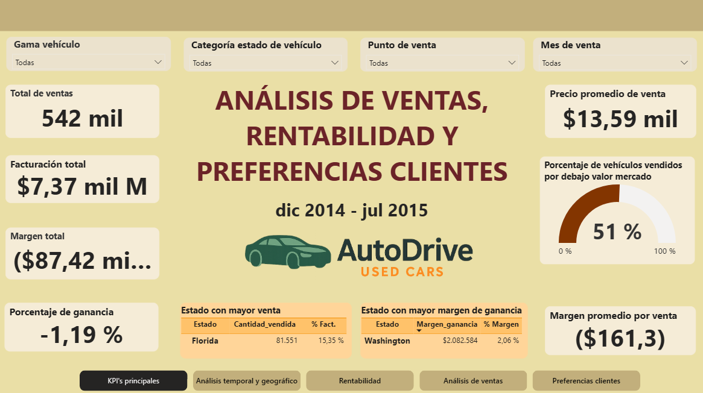

# 🚗 Data-Driven Insights para la Optimización de Ventas de Vehículos Usados en EE.UU.

**Autores:** Ghiselle Butron & Guido Riega  
**Bootcamp Data analytics – Unicorn Academy**

---

## 📌 Resumen

Análisis de más de **550.000 registros** de ventas de vehículos usados con el objetivo de mejorar los **márgenes de ganancia**, entender el **comportamiento del cliente**, y optimizar la estrategia comercial de AutoDrive, una empresa automotriz con operaciones en EE.UU., Canadá y Puerto Rico.

---

## 🎯 Objetivos del Proyecto

- Analizar las ventas por región, fecha y segmento del vehículo.
- Identificar factores que afectan la rentabilidad: estado vehículo, antigüedad, kilometraje.
- Detectar preferencias de los clientes: marcas, carrocerías, tipo de transmisión, pintura exterior.
- Generar recomendaciones basadas en datos para maximizar los márgenes.

---

## 🗃️ Dataset

- Fuente: Datos internos de AutoDrive (datos extraídos de Kaggle)
- Registros: 558.837 ventas
- Período de análisis: Dic 2014 – Jul 2015
- Formato: `.csv`
- Variables: marca, modelo, año, estado, transmisión, color, precio de mercado, precio de venta, ubicación, etc.

---

## 🛠️ Herramientas Utilizadas

- **MySQL**: limpieza, modelado relacional, validación
- **Power BI**: visualización interactiva, KPIs, segmentaciones
- **DAX**: creación de medidas, columnas calculadas, tabla calendario
- **Excel**: revisión inicial de datos

---

## 🔄 Proceso de Desarrollo

### 1. Limpieza y modelado de datos (SQL)
- Eliminación de registros nulos, duplicados e inconsistentes.
- Estandarización de marcas, colores, carrocerías, etc.
- Conversión de datos a tipos adecuados.
- Creación de modelo relacional con tabla de hechos y dimensiones.

### 2. Visualización y análisis (Power BI)
- Cálculo de KPIs: margen, volumen de ventas, % bajo valor de mercado.
- Creación de tabla calendario y medidas DAX.
- Diseño de dashboard dividido en 5 secciones:
  - KPI’s generales
  - Análisis temporal y geográfico
  - Rentabilidad por segmentos
  - Detalle de ventas
  - Preferencias de clientes

---

## 📊 Dashboard Interactivo

📸 **Vista previa del dashboard**  

🔗 **Enlace al dashboard en Power BI**
https://app.powerbi.com/links/sB0X4B23tC?ctid=b1f0082a-61cf-4abf-a4d9-7e81f64c920a&pbi_source=linkShare

---

## 🔍 Hallazgos Principales

- **41%** de los vehículos en buen estado se vendieron **por debajo del valor de mercado**.
- Estados como **Florida y California** tienen mucho volumen pero baja rentabilidad.
- Clientes prefieren vehículos **recientes, gama media, tipo de carrocería sedán y SUVs, tipo de transmisión automática y colores neutros: negro, blanco y plateado**.
- Las ventas se concentran entre los días **martes y jueves**.

---

## ✅ Recomendaciones Estratégicas

- Priorizar compra de vehículos **en excelente estado y recientes**.
- Implementar **políticas de pricing dinámico**.
- Reforzar operaciones en estados con mejor margen (ej. Washington).
- Mantener una oferta equilibrada entre marcas populares y premium.
- Optimizar stock según preferencias del cliente.

---

## 📂 Estructura del Repositorio
ventas-autos-usados/
├── README.md
├── data/
│ └── car_prices.csv
├── sql/
│ ├── limpieza.sql
│ ├── modelo_relacional.sql
│ └── vista_registros_eliminados.sql
├── powerbi/
│ └── dashboard.pbix
├── imagenes/
│ └── dashboard.png
├── docs/
│ └── memoria-proyecto.pd

---

## 📫 Contacto

- 📧 ghiselle.b@gmail.com  
- 🔗 [LinkedIn - Ghiselle](https://www.linkedin.com/in/ghiselle-butron-reyes/)  

